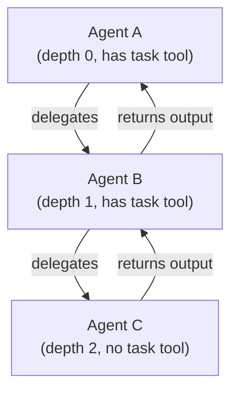

# Agents

!!! info "llm-coding-tools supports loading agent definitions from markdown files with YAML frontmatter."

The agent file format mirrors [OpenCode]'s schema, similar enough that many
files are drop-in compatible, but [not identical](migration.md). See
[Migrating from OpenCode](migration.md) for details.

## Agent file format

An agent file is a markdown file with YAML frontmatter delimited by `---`:

```yaml
---
name: code-searcher
mode: subagent
description: Searches codebases to find relevant files and extracts content
model: synthetic/hf:moonshotai/Kimi-K2.5
permission:
  read: allow
  grep: allow
  glob: allow
  task: deny
tool_settings:
  read:
    line_numbers: false
  grep:
    line_numbers: false
temperature: 0.2
---

You are a code search assistant. Use grep to find relevant files and code patterns,
then read the matching files to extract and summarize the content.
```

### Frontmatter fields

**Required:**

| Field         | Description                                                |
| ------------- | ---------------------------------------------------------- |
| `description` | What this agent does. Shown when listing available agents. |

**Optional:**

| Field           | Default         | Description                                                                                                         |
| --------------- | --------------- | ------------------------------------------------------------------------------------------------------------------- |
| `name`          | filename        | Agent identifier. If omitted, derived from the file path (e.g. `basic/file-reader.md` becomes `basic/file-reader`). |
| `mode`          | `all`           | Agent behaviour: `all`, `primary`, or `subagent`.                                                                   |
| `model`         | runtime default | LLM to use. Format: `provider/model-id` or `synthetic/hf:huggingface-model-id`.                                    |
| `permission`    | all denied      | Map of tool names to `allow`/`deny`.                                                                                |
| `tool_settings` | defaults        | Per-tool configuration (line numbers, limits, timeouts).                                                            |
| `temperature`   | model default   | Sampling temperature.                                                                                               |
| `top_p`         | model default   | Nucleus sampling parameter.                                                                                         |

### Mode

| Mode       | Description                                                                   |
| ---------- | ----------------------------------------------------------------------------- |
| `all`      | Both primary and subagent capabilities. Can be used directly or delegated to. |
| `primary`  | Top-level agent. Can delegate work to subagents via the `task` tool.          |
| `subagent` | Can only be invoked by other agents. Not available for direct use.            |

### Permissions

Permissions are **default-deny**: every tool is blocked unless you explicitly
allow it.

```yaml
permission:
  read: allow
  write: deny
  bash: allow
  task: allow  # Required to delegate to subagents
```

#### Pattern-based rules

Several tools support wildcard patterns instead of a simple `allow`/`deny`.
Evaluation uses **last-match-wins**: the final matching rule takes effect.

| Pattern | Meaning                        |
| ------- | ------------------------------ |
| `**`    | Any depth, workspace-relative  |
| `*`     | Workspace root only            |
| `/**`   | Any file on the system         |
| `?`     | Exactly one character          |

For the full rule table and examples, see
[Tools > Permission rules](tools.md#permission-rules).

### Model specification

Format: `provider/model-id` or `synthetic/hf:huggingface-model-id`.

`synthetic` is the provider name; `hf` selects a HuggingFace model by its
repository ID (e.g. `moonshotai/Kimi-K2.5`).

Examples:

- `openai/gpt-5.4`
- `synthetic/hf:zai-org/GLM-5`
- `ollama-cloud/minimax-m2.7`
- `synthetic/hf:moonshotai/Kimi-K2.5`

Model names are validated against the [models.dev] catalog at runtime; an
unrecognized name will produce a load error.

Load the catalog before resolving agents. See
[Models Catalog](models-catalog.md) for setup instructions and the
`llm-coding-tools-models-dev` crate API.

### Tool settings

Per-tool configuration that overrides defaults. For the full reference with
types, ranges, and validation rules, see [Tools > Tool Settings](tools.md#tool-settings).

With the agent file format defined, the next sections cover loading those
files into a catalog and building a runtime.

## Loading agents

Use `AgentLoader` to scan directories and `AgentCatalog` to store them:

```rust
use llm_coding_tools_agents::{AgentCatalog, AgentLoader};

fn main() -> Result<(), llm_coding_tools_agents::AgentLoadError> {
    let loader = AgentLoader::new();
    let mut catalog = AgentCatalog::new();

    loader.add_directory(&mut catalog, "/home/user/.opencode")?;

    for agent in catalog.iter() {
        println!("{}: {}", agent.name, agent.description);
    }
    Ok(())
}
```

File discovery walks the directory tree with `.gitignore` support, selecting
only files matching `agent/**/*.md` or `agents/**/*.md`.

## Building an agent runtime

Combine the catalog with defaults to create an `AgentRuntime`:

```rust
use llm_coding_tools_agents::{
    AgentCatalog, AgentDefaults, AgentLoader, AgentRuntimeBuilder,
};

fn main() -> Result<(), llm_coding_tools_agents::AgentLoadError> {
    let loader = AgentLoader::new();
    let mut catalog = AgentCatalog::new();
    loader.add_directory(&mut catalog, "/home/user/.opencode")?;

    let runtime = AgentRuntimeBuilder::new()
        .catalog(catalog)
        .defaults(AgentDefaults::with_model("openai/gpt-5.4"))
        .max_task_depth(5)  // optional; defaults to 3
        .build();
    Ok(())
}
```

Then pass the runtime to a framework adapter (a type that wires the catalog,
model, and tools into a runnable LLM agent), such as
`AgentBuildContext::new()` from `llm-coding-tools-serdesai` ([SerdesAI])
to build runnable agents by name.

## Task delegation

With the [SerdesAI] adapter, the builder automatically attaches the `task`
tool when both conditions hold:

1. The agent has callable sub-agents (agents with mode `subagent` or `all` in the catalog)
2. The current depth is below `max_task_depth`

The flow:

1. Agent A calls `task` with a sub-agent name and prompt
2. The task tool validates permissions and depth
3. It recursively builds the sub-agent with its own tool set
4. The sub-agent runs and returns its output
5. Agent A receives the output as the tool result

Depth is limited to prevent infinite delegation chains. The default is 3.



[SerdesAI]: https://crates.io/crates/serdes-ai
[OpenCode]: https://opencode.ai/
[models.dev]: https://models.dev
