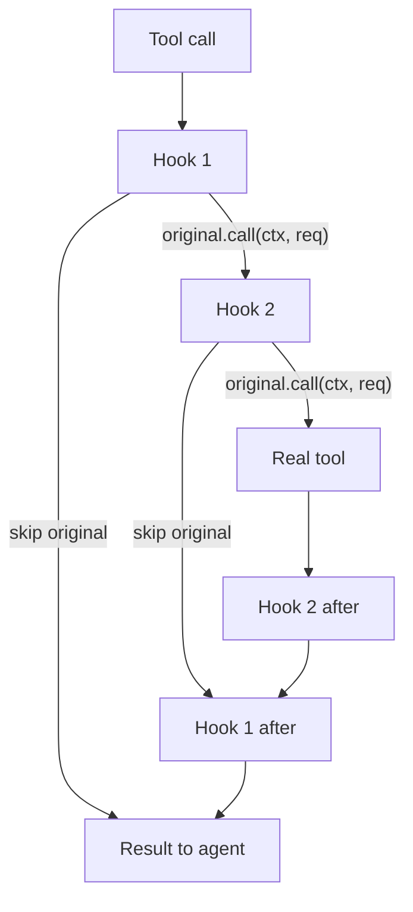

# Hooks

Hooks let your code see, change, or stop things the agent does.

Tool hooks work like game mods.
Each hook gets an `original` function.
`original` calls the next hook or the real tool.

This lets you run code before and after the tool call in the same method.

## Examples

### Observe and wrap a tool call

A hook can modify the request before the tool sees it, or rewrite the
result after the real tool runs.

The full example takes the result path: a real `read` runs, and the
hook scrubs the `API_KEY=` and `TOKEN=` values from the result before
the model sees them. Permission rules can allow or deny the call; they
cannot rewrite what the tool returns.

`$HOME` in string arguments expands to the user's home directory:

```rust
use std::env;
use serde_json::Value;
use reloaded_code_core::{
    HookSet, ToolCallContext, ToolHook, ToolHookFuture, ToolOriginal,
    ToolOutput, ToolRequest,
};

struct HomeExpander;

impl ToolHook for HomeExpander {
    fn hook<'a>(
        &'a self,
        ctx: &'a ToolCallContext<'a>,
        mut req: ToolRequest,
        original: ToolOriginal<'a>,
    ) -> ToolHookFuture<'a> {
        Box::pin(async move {
            // Expand $HOME → real home directory in all string args
            if let Some(home) = env::var("HOME").ok() {
                if let Some(map) = req.args.as_object_mut() {
                    for val in map.values_mut() {
                        if let Value::String(s) = val {
                            *s = s.replace("$HOME", &home);
                        }
                    }
                }
            }

            original.call(ctx, req).await
        })
    }
}

let hooks = HookSet::builder()
    .tool_hook(HomeExpander)
    .build();
```

Full example: [serdesai-tool-hook]
(`cargo run --example serdesai-tool-hook -p reloaded-code-serdesai --features mock`).

### Block a tool call

To block or replace a tool call, do not call `original`.

The full example keeps state across calls: the hook records every file
the run reads, then denies a `write` to a file that was never read, so
the real `write` never executes. Permission rules cannot make a
decision depend on earlier calls.

A common case: prevent credential leaks by blocking read/write access
to `.env` files.

```rust
use reloaded_code_core::{
    HookSet, ToolCallContext, ToolHook, ToolHookFuture, ToolOriginal,
    ToolOutput, ToolRequest,
};

struct EnvFileGuard;

impl ToolHook for EnvFileGuard {
    fn hook<'a>(
        &'a self,
        ctx: &'a ToolCallContext<'a>,
        req: ToolRequest,
        original: ToolOriginal<'a>,
    ) -> ToolHookFuture<'a> {
        Box::pin(async move {
            // Block access to .env files
            if let Some(path) = req.args.get("path").and_then(|v| v.as_str()) {
                if path.starts_with(".env") || path.contains("/.env") {
                    return Ok(ToolOutput::new(
                        "Blocked: .env files contain secrets"
                    ));
                }
            }

            // All other calls pass through
            original.call(ctx, req).await
        })
    }
}

let hooks = HookSet::builder()
    .tool_hook(EnvFileGuard)
    .build();
```

Full example: [serdesai-tool-block]
(`cargo run --example serdesai-tool-block -p reloaded-code-serdesai --features mock`).

### Stack hooks

Hooks run in registration order. Each hook wraps the next one, so code after
`original.call(...)` runs in reverse order.

The full example stacks an audit hook that logs the original `bash`
arguments with a hardening hook that injects a `timeout_ms` before the
real tool runs.

`tool_hook` takes ownership of the hook. `shared_tool_hook` registers an
existing `Arc<dyn ToolHook>` when the same instance must be used in several
hook sets:

```rust
use std::sync::Arc;
use reloaded_code_core::{
    HookSet, ToolCallContext, ToolHook, ToolHookFuture, ToolOriginal, ToolRequest,
};

struct AuditHook(&'static str);

impl ToolHook for AuditHook {
    fn hook<'a>(
        &'a self,
        ctx: &'a ToolCallContext<'a>,
        req: ToolRequest,
        original: ToolOriginal<'a>,
    ) -> ToolHookFuture<'a> {
        Box::pin(async move {
            println!("{}: before {}", self.0, ctx.tool_name);
            let output = original.call(ctx, req).await?;
            println!("{}: after {}", self.0, ctx.tool_name);
            Ok(output)
        })
    }
}

let shared: Arc<dyn ToolHook> = Arc::new(AuditHook("inner"));
let hooks = HookSet::builder()
    .tool_hook(AuditHook("outer"))
    .shared_tool_hook(shared)
    .build();
```

Full example: [serdesai-tool-chain]
(`cargo run --example serdesai-tool-chain -p reloaded-code-serdesai --features mock`).

### Amend run config

`RunConfigHook` changes a run's config before the run starts. `RunConfig`
holds the system prompt, preamble messages, and model settings overrides
(temperature, top_p). `configure` mutates the config in place:

```rust
use reloaded_code_core::{
    HookRunContext, HookSet, PreambleMessage, PreambleRole, RunConfig,
    RunConfigHook, RunConfigHookFuture,
};

struct PreambleInjector;

impl RunConfigHook for PreambleInjector {
    fn configure<'a>(
        &'a self,
        _ctx: &'a HookRunContext<'a>,
        config: &'a mut RunConfig,
    ) -> RunConfigHookFuture<'a> {
        Box::pin(async move {
            config.preamble_messages.push(PreambleMessage {
                role: PreambleRole::System,
                content: "You are a helpful assistant.".into(),
            });
            Ok(())
        })
    }
}

let hooks = HookSet::builder()
    .run_config_hook(PreambleInjector)
    .build();
```

A `RunConfigHook` runs before the request is made. Hooks run in
registration order; the chain stops at the first error, and the run does
not start.

Full example: [serdesai-run-config-hook]
(`cargo run --example serdesai-run-config-hook -p reloaded-code-serdesai --features mock`).

### Observe run start and end

A `RunHook` observes without changing anything: log before calling
`original`, inspect the result after.

The `config` argument is a read-only view of the final `RunConfig`.
Register a `RunConfigHook` to change it:

```rust
use reloaded_code_core::{
    EndReason, HookRunContext, HookSet, RunConfig, RunHook, RunHookFuture,
    RunOriginal,
};

struct RunObserver;

impl RunHook for RunObserver {
    fn hook<'a>(
        &'a self,
        ctx: &'a HookRunContext<'a>,
        _config: &'a RunConfig,
        original: RunOriginal<'a>,
    ) -> RunHookFuture<'a> {
        Box::pin(async move {
            println!("run starting for {}", ctx.agent_name);
            let result = original.call(ctx).await;
            let reason = match &result {
                Ok(output) => output.reason,
                Err(_) => EndReason::Failed,
            };
            println!("run ended for {} ({:?})", ctx.agent_name, reason);
            result
        })
    }
}

let hooks = HookSet::builder()
    .run_hook(RunObserver)
    .build();
```

Code after `original` runs when the wrapped continuation finishes,
including failure: a failed run reports `EndReason::Failed` and the
error still propagates to the caller. An outer hook that skips
`original` never reaches this hook, so do not rely on it for cleanup
that must run on every path.

Full example: [serdesai-run-hook]
(`cargo run --example serdesai-run-hook -p reloaded-code-serdesai --features mock`).

### Intercept streamed events

Run-event hooks fire only on `run_stream()`. Each event passes the
registered `RunEventHook`s, in registration order, only until one
suppresses it with `Ok(None)` or rejects it with `Err(ToolError)`;
a rejection also terminates the stream.

Per event, a hook returns one of three decisions:

- `Ok(Some(event))` publishes it, changed or unchanged.
- `Ok(None)` suppresses it. Later hooks and the consumer never see it.
- `Err(ToolError)` stops dispatch; the stream ends with
  `Err(AgentRunError::Other)`.

This hook forwards the events a TUI renders. The consumer still sees
every event:

```rust
use reloaded_code_core::{HookSet, RunEventContext, RunEventHookResult};
use reloaded_code_serdesai::{RunEvent, RunEventHook};

struct TuiSender { /* channel to the UI thread */ }

impl TuiSender {
    /// Stub: cheap, non-blocking send; the UI thread draws.
    fn send_to_tui(&self, _event: &RunEvent) {}
}

struct ForwardToTui {
    tui: TuiSender,
}

impl RunEventHook for ForwardToTui {
    fn hook(&self, _ctx: &RunEventContext<'_>, event: RunEvent) -> RunEventHookResult {
        // Forward only what the TUI renders
        match &event {
            RunEvent::TextDelta { .. } | RunEvent::RunComplete { .. } => {
                self.tui.send_to_tui(&event);
            }
            _ => {}
        }
        Ok(Some(event))
    }
}

let hooks = HookSet::builder()
    .run_event_hook(ForwardToTui { tui: TuiSender {} })
    .build();
```

Hooks run synchronously at token rate; keep per-event work cheap. Each
call sees one event. Text can split across several `TextDelta`s, so
buffer cross-event context inside the hook.

Full example: [serdesai-run-event-hook] rewrites text deltas to
uppercase and suppresses the output-ready milestone
(`cargo run --example serdesai-run-event-hook -p reloaded-code-serdesai --features mock`).

## How tool hooks stack

This diagram assumes you register two hooks. If you set no hooks, the
tool call goes straight to the real tool (fast path).

Tool hooks run in registration order. Each hook receives an `original`
function. That function calls the next hook or the real tool.


This works like game mods.
Your hook gets a function.
That function is `original`.
It calls the next hook, not always the real tool.

## Getting started

Build a `HookSet` with your hooks, then pass it to the runtime:

```rust
use reloaded_code_agents::AgentRuntimeBuilder;
use reloaded_code_core::HookSet;

let hooks = HookSet::builder()
    .tool_hook(EnvFileGuard)
    .build();

let runtime = AgentRuntimeBuilder::new()
    .hooks(hooks)
    .build()?;

assert!(!runtime.hooks().is_empty());
```

Calling `.hooks(set)` replaces any existing `HookSet`. Omitting it
passes `HookSet::default()`.

## Design notes

- **Everything is a hook**: Observers are plain `RunHook`s. Code before
  `original` is "start", code after is "end". They participate in the
  same hook chain with the same ordering rules.

- **Natural unwind order.** Hook code after `original.call(...)` runs in
  reverse order. Later hooks run first after the operation.

- **Blocking by omission.** A hook blocks or replaces a call by not calling
  `original`.

- **Empty fast path.** `dispatch_tool` calls the real tool directly when you
  set no hooks.

[serdesai-tool-hook]: https://github.com/Reloaded-Project/ReloadedCode/blob/main/src/reloaded-code-serdesai/examples/hooks/tool/serdesai-tool-hook.rs
[serdesai-tool-block]: https://github.com/Reloaded-Project/ReloadedCode/blob/main/src/reloaded-code-serdesai/examples/hooks/tool/serdesai-tool-block.rs
[serdesai-tool-chain]: https://github.com/Reloaded-Project/ReloadedCode/blob/main/src/reloaded-code-serdesai/examples/hooks/tool/serdesai-tool-chain.rs
[serdesai-run-config-hook]: https://github.com/Reloaded-Project/ReloadedCode/blob/main/src/reloaded-code-serdesai/examples/hooks/run/serdesai-run-config-hook.rs
[serdesai-run-hook]: https://github.com/Reloaded-Project/ReloadedCode/blob/main/src/reloaded-code-serdesai/examples/hooks/run/serdesai-run-hook.rs
[serdesai-run-event-hook]: https://github.com/Reloaded-Project/ReloadedCode/blob/main/src/reloaded-code-serdesai/examples/hooks/run/serdesai-run-event-hook.rs
